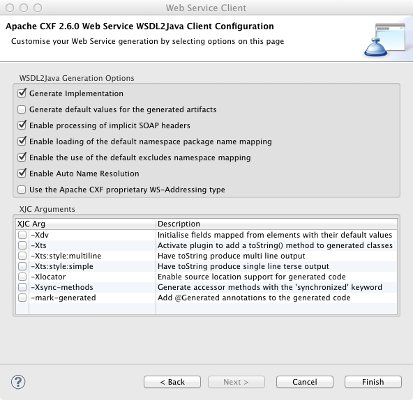

# Setting up to work with the TravelPort Universal API

## Unit 1, Lesson 1

### Objective Of Unit 1

After working through the three lessons of Unit 1, you should be able to work with the TravelPort Universal API to make requests for services and understand the responses.  You will become familiar with "web services" if you are not already.

### Programming Language Agnostic And WSDL

Although these lessons are using Java, the lessons' concepts apply to pretty much any programming language.  The _interface_ to the Universal API (uAPI) is defined with [WSDL](http://en.wikipedia.org/wiki/Web_Services_Description_Language) or Web Services Definition Language, pronounced "whiz-dul".  This means that any programming language that knows how to "use web services" can access the APIs and get useful things done.  In practice, this means that you need a _generator_ that can take a file "foo.wsdl" and spit out "foo_client.java", or whatever, in your favorite language.  Different generators have slightly different behaviors (of course, WSDL is a "standard", and these differences sadly a fact of life when dealing with standards that have multiple versions and different versions implemented by different vendors); we'll be using [Apache's CXF](http://cxf.apache.org/) to work with the uAPI in Java.  ("CXF" is not an acronym, but is related to the project's origin.)

### Credentials

If you don’t have them already, you’ll need to request a set of 30-day trial credentials for using the uAPI. You can request these [online](http://www.travelportdeveloperdirectory.com/forms/request-test-access.php). However, this web page cannot be navigated to via the menus on [the developer network site](http://developer.travelport.com/app/developer-network/resource-centre-uapi) unless you have already created an account on the [developer site](http://developer.travelport.com). When you request test credentials, you should choose “Galileo” as your preferred GDS.  After you have filled out the form, in a few minutes you’ll receive some email from “webmaster@travelport.com” with the relevant information.

### Downloading The Tutorial Code

You can download the tutorial code using github to clone the repository. You can use your favorite [git tool](https://git.wiki.kernel.org/articles/i/n/t/Interfaces,_frontends,_and_tools.html) or just use the command line like this:

```bash
> mkdir learn-tport
> cd learn-tport
> git clone git@github.com:iansmith/travelport-uapi-tutorial.git

```

This last command will create the directory `travelport-uapi-tutorial` and within that directory you will find the a few files that we will discuss later, plus the directories `src` and `wsdl`.  If you explore the `wsdl` directory, you'll see many WSDL files as well as a number of [XML schemas](http://en.wikipedia.org/wiki/XSD), as `xsd` files.  All of these files have been supplied by TravelPort and can be downloaded as version 2.1.0.1 of the uAPI from [their developer site](http://developer.travelport.com) as well.

For the rest of the tutorial we'll assume that you have created a java (or web services) project in eclipse and have put all the  code provided by tutorial at the top level of the project.  You will see a `src` and a `wsdl` directory when you have done this correctly.

### Apache CXF

Apache's CXF is the critical "glue" for connecting TravelPort's web services to our tutorial code.  (There are plenty of other choices for interacting with web services in Java, but CXF is just a very popular one.)  You'll need to [download and install](http://cxf.apache.org/download.html) the Apache CXF code; this tutorial expects you to be using at least version 2.6.0.  If you are using [Eclipse](http://www.eclipse.org) like most Java developers, you can install the CXF directly into Eclipse by going to "Preferences > WebServices".  (If you don't have this preference option, you'll need to install the [Web Tools Platform](http://www.eclipse.org/webtools/), or WTP, for Eclipse.)  The preferences screen where you add your installation of CXF should look something like this (with the preference choice highlight by the red box).  

<br/>

<br/>

If you are not using eclipse, you'll need to be sure that the CXF jar files are [in your classpath](http://docs.oracle.com/javase/tutorial/essential/environment/paths.html) and that you can run the command 'cxf' from the command line.  Be aware that there many java libraries that are "subsumed" by CXF, so you'll end up with about 75 libraries in your classpath!


### Generating A Java Version Of The API

We need to generate java code from the WSDL and XSD files supplied by TravelPort's uAPI.  Let's start by generating the Java code for the "System" service.  In eclipse, you can do this by selecting the WSDL file `System.wsdl` in the directory `wsdl/system_v8_0` and then using the context-menu in eclipse to choose "Generate Client", as is shown here:

<br/>

<br/>

When you select that option in eclipse, you'll be presented with a sequence of three dialog boxes connected by hitting the `Next` button.  The vast majority of these options are really not of much interest to us for this tutorial, but to show you exactly the options to choose you can verify your configuration against this set as these screenshots:

<br/>

<br/>

<br/>

<br/>

On the first screenshot in this sequence, the red box indicates a slider.  This slider can be moved to another position, non error position, if you are the type of person who doesn't like having "errors" on your screen.  The last dialog box in the sequence shows that there are number of checkboxes selected; these control various options in CXF's generation of the Java code.  The lower set of checkboxes that are checked (such as -Xts and -Xts:multiline) are not crucial to having the tutorial work properly, but do make debugging easier.

#### Command Line Generation Of A Java Client

If you are using the command line, you can do manually what eclipse does behind the scenes based on the values given in these dialogs. Below is a very complex command line generated by eclipse that you can start from, although you will need to adjust the paths to your local machine. 

```
wsdl2java -client -d /Users/iansmith/tport-workspace/uapijava/.cxftmp/src -classdir /Users/iansmith/tport-workspace/uapijava/build/classes -p http://www.travelport.com/service/system_v8_0=com.travelport.service.system_v8_0 -impl -validate -exsh true -dns true -dex true -autoNameResolution -xjc-Xts,-Xts:style:multiline,-Xlocator,-mark-generated -wsdlLocation http://localhost:8080/kestrel/ExternalCacheAccessService?wsdl -verbose -fe jaxws -db jaxb -wv 1.1 file:/Users/iansmith/tport-workspace/uapijava/wsdl/system_v8_0/System.wsdl
```

### The Java Client For "System"

If you use the WDT viewer for a WSDL file, you will see this image when you open `wsdl/system_v8_0/System.wsdl`:

<br/>

<br/>

(There are tabs at the bottom of the main editor view to control whether you view this file in "design view" or as a normal source code file.)  This diagram shows you that there are two "Services" exposed by`System` : `ExternalCacheAccessService` and `SystemService`.  Often we will get sloppy with the nomenclature and refer to the "system service" as any object that is accessible from objects _generated from the System.wsdl file_.  In this case, the real, concrete class `SystemService` is derived from `System.wsdl` so there is less confusion, but this can become more confusing with WSDL files (like `Air.wsdl`) that expose many "services" as a by-product of generating the code for the "Air service." Whew, a lot of uses of "service"!
 
We will be working only with `SystemService` for the rest of this lesson.  You can see the java code that has been generated for this service in your project's src folder, the class `com.travelport.service.system_v8_0.SystemService`.  Although you are welcome to read and explore the source, the good news is that you can *safely ignore* all the implementation details about this service.  The beauty of WSDL is not knowing!

Referring back to the diagram for `SystemService` above, you'll see that there are three "ports" exposed by the `SystemService`: `SystemInfoPortType`, `SystemPingPortType`, and the `SystemTimePortType`.  In the code for this lesson, we'll run a simple ping request through the `SystemPingPortType`.

### The Programming Model

The pattern used by the uAPI design is to expose a "port" which has a single method called "service." Usually we refer to the port object just by its name without the prefix or suffix such as "the ping port" or just "ping."  (All the ports exposed from the file `System.wsdl` start with "System" and end with "PortType.")  The ping port's only method is "service," as you can see from the diagram; far more interesting is the fact the diagram shows you the input and output parameters are of type `PingReq` and `PingRsp` for the request and response respectively.  You can find the source code for these classes in the src Java folder with the name `com.travelport.schema.system_v8_0.PingReq` or you can explore them with design view of `System.wsdl`.  Again, the details of the implementation are not important to you, you can just _use_ these facilities as part of the uAPI.

We now have the logical pieces necessary to understand how to use functionality exposed by the uAPI.  Let's think about this sequence of actions concretely with the ping port as an example:

* Create an object of type `PingReq`
* Fill in the necessary fields of the 'PingReq` using its "setter" methods
* Create an instance of the `SystemService`
* Access the `SystemService` object to get an object of type `SystemPingPortType`
* Call the method `service` on the `SystemPingPortType` instance, passing the `PingReq` object created in step 1
* Examine the results of our request by looking at the `PingRsp` object using its "getter" methods

With very few exceptions, all the features and functions of the uAPI follow this pattern of "build the request parameters and use the port object to get the results."

### Lesson 1 Proper

The file [Lesson1.java](https://github.com/iansmith/travelport-uapi-tutorial/blob/master/src/com/travelport/uapi/unit1/Lesson1.java) is in the Java package [com.travelport.uapi.unit1](https://github.com/iansmith/travelport-uapi-tutorial/tree/master/src/com/travelport/uapi/unit1).  You'll notice that in the web-viewable version of this tutorial, we often make the names of files and packages direct links into the github repository for the tutorial.  This makes it easy for those that just want to read the tutorial without "playing along at home" by compiling/running all the examples.

Let's examine the `main` method of Lesson 1:

```java
public static void main(String[] argv) {		
	//
	// PING REQUEST
	//
	String payload= "this my payload; there are many like it but this one is mine";
	String someTraceId = "doesntmatter-8176";
	
	//set up the request parameters into a PingReq object
	PingReq req = new PingReq();
	req.setPayload(payload);
	req.setTraceId(someTraceId);
	
	try {
		//run the ping request
		PingRsp rsp = WSDLService.getPing(false).service(req);
		//print results.. payload and trace ID are echoed back in response
		System.out.println(rsp.getPayload());
		System.out.println(rsp.getTraceId());
		System.out.println(rsp.getTransactionId());
	} catch (SystemFaultMessage e) {
		//usually only the error message is useful, not the full stack
		//trace, since the stack trace in is your address space...
		System.err.println("Error making ping request: "+e.getMessage());
	}
}
```

The code in `main()` above follows exactly the pattern explained in the programming model section: we set up a `PingReq` object with the proper parameters and then pass them through to the uAPI via the ping port.  The only unexpected part of this simple example is the call to `WSDLService.getPing(false)` that returns the ping port object. The false parameter indicates that you do not want a copy of the XML input and output sent to the console; setting this to _true_ can often help your understanding of what is happening! `WSDLService` is a helper class that has been provided with the tutorial to simplify things and allow you to focus on the essential parts of the uAPI and not the details...

### The Details

You will need to configure your copy of the class `WSDLService` slightly to allow you to use the uAPI. You should not need to do this again!  If you look inside [WSDLService](https://github.com/iansmith/travelport-uapi-tutorial/blob/master/src/com/travelport/uapi/unit1/WSDLService.java) in the package [com.travelport.uapi.unit1](https://github.com/iansmith/travelport-uapi-tutorial/tree/master/src/com/travelport/uapi/unit1) you will see the things that you may need to change:

```java

// these endpoint parameters vary based on which region you are
// in...check your travelport sign up to see which url you should use...
static protected String SYSTEM_ENDPOINT = "https://emea.universal-api.travelport.com/B2BGateway/connect/uAPI/SystemService";
static protected String AIR_ENDPOINT = "https://emea.universal-api.travelport.com/B2BGateway/connect/uAPI/AirService";
```

The URLs above, called "endpoints" in the parlance of WSDL, may need to be changed if you are not in the EMEA (Europe, Middle East, Africa) geography.  The functionality is the same from any endpoint, the only difference are which servers are used to provide the functionality.

If you try to run the `Lesson1` code either from the command line or from Eclipe's Run menu you'll get an error like this:

```
Exception in thread "main" java.lang.RuntimeException: One or more of your properties has not been set properly for you to access the travelport uAPI.  Check your command line arguments or eclipse run configuration for these properties:travelport.username,travelport.password,travelport.gds,travelport.targetBranch
```

This error indicates that you have not set some "java properties" (often done using the -D option from the command line) in your Run configuration.  You access or create run configurations in Eclipse with "Run" then "Run Configuration..." from the primary Eclipse menubar.  Here is a screenshot of how to configure your (and Lesson1's) environment via the "Arguments" tab and supplying "VM arguments":

<br/>

<br/>

The red boxes show you the tab you need to use to get to this configuration option and where to supply the values. The values are included in your sign-up documents from the TravelPort website.  Note that each of the parameters is of the form -Dxxx="yyy" and are separated by spaces.  The values are always quoted and the names always begin with "travelport".

After you have made the adjustments necessary for your account to this panel, return to the [WSDLService](https://github.com/iansmith/travelport-uapi-tutorial/blob/master/src/com/travelport/uapi/unit1/WSDLService.java) file one last time.  You'll see the `URLPrefix` value is set like this near the top of the file:

```java
static protected String URLPREFIX = "file:///Users/iansmith/tport-workspace/uapijava/";
```

This is a path on the tutorial developer's home machine, so not likely to be correct for your local computer!  You should adjust this to be the prefix of a URL that points to the root of your project. Note that URLs start with "file:///"  and use forward slash (/) to separate directories, even if you are running on the Windows operating system.  You need to be sure to include a trailing slash as well, beacuse various other values are derived from `URLPREFIX` by concatenation.

After you have made this adjustment, you should be able to run Lesson1 via your run configuration created above.  If you see an error like this:

```
Exception in thread "main" javax.xml.ws.WebServiceException: org.apache.cxf.service.factory.ServiceConstructionException: Failed to create service.
	at org.apache.cxf.jaxws.ServiceImpl.<init>(ServiceImpl.java:150)
	at org.apache.cxf.jaxws.spi.ProviderImpl.createServiceDelegate(ProviderImpl.java:97)
	at javax.xml.ws.Service.<init>(Service.java:56)
	at com.travelport.service.system_v8_0.SystemService.<init>(SystemService.java:41)
	at com.travelport.uapi.unit1.WSDLService.getPing(WSDLService.java:133)
	at com.travelport.uapi.unit1.Lesson1.main(Lesson1.java:23)
Caused by: org.apache.cxf.service.factory.ServiceConstructionException: Failed to create service.
	at org.apache.cxf.wsdl11.WSDLServiceFactory.<init>(WSDLServiceFactory.java:94)
	at org.apache.cxf.jaxws.ServiceImpl.initializePorts(ServiceImpl.java:204)
	at org.apache.cxf.jaxws.ServiceImpl.<init>(ServiceImpl.java:148)
	... 5 more
Caused by: javax.wsdl.WSDLException: WSDLException: faultCode=PARSER_ERROR: Problem parsing 'file:/Users/iansmith/tport-workspace/uapijava/wsdl/system_v8_0/System.wsdl'.: java.io.FileNotFoundException: /xUsers/iansmith/tport-workspace/uapijava/wsdl/system_v8_0/System.wsdl (No such file or directory)
	at com.ibm.wsdl.xml.WSDLReaderImpl.getDocument(Unknown Source)
	...
```

Then you have misconfigured the `URLPREFIX` above and you should re-check the value you gave for it. It should point to the directory that is the _parent_ of the `wsdl` and `src` directories in your project.

### The Pay-Off

The final result of all this work--hopefully the last time you'll need to do this type of thing in this tutorial for a long while--is when you can run `Lesson1` and see this output like this:

```
this my payload; there are many like it but this one is mine
doesntmatter-8176
E07E825F0A07580E004DED8EB9130465
```

The last value is a transaction ID that is unique to each call on the uAPI, so it will differ from what is shown here.  When you see this output, you have run a "ping" to the TravelPort service and successfully gotten back the values transmitted.  Although this seems trivial, this is good news because it means that all the layers of software and networking (and there are plenty!) between your computer and TravelPort's servers are working as expected!

### The Other Gunk

You will also probably see some messages (usually in red, because they are directed to the system's default error log) like this in your eclipse console:

```
INFO: Creating Service {http://www.travelport.com/service/system_v8_0}SystemService from WSDL: file:/Users/iansmith/tport-workspace/uapijava/wsdl/system_v8_0/System.wsdl
```

This is a helpful message provided by the CXF framework to tell you it is creating a service based on a WSDL file and giving you some information about the endpoint it is using.  You control the "chattiness" of the CXF infrastructure by adjusting the values in the [logging.properties](https://github.com/iansmith/travelport-uapi-tutorial/blob/master/src/com/travelport/uapi/unit1/logging.properties) file, just as with most other java applications.  Most people can safely ignore these messages, unless they are printed out to the `Warning` or `Error` logging levels!

### Exercises for the reader
 * Create a run configuration as above but for the [SystemSvcTest](https://github.com/iansmith/travelport-uapi-tutorial/blob/master/src/com/travelport/uapi/unit1/SystemServiceTest.java) test code.  This is a JUnit4 style test suite so will require the appropriate configuration type in the Run Configurations menu.

 * Change the ping values in Lesson1 and prove to yourself that the values being returned are the values you supplied.

 * Modify the code in Lesson1 to use the "time port" (`SystemTimePortType`).  This will require that you discover how to get access to different ports (via the `WSDLService` helper class) and that you supply different request and response types to match the appropriate types for this different function.   The `time port` returns the current time according to TravelPort if you succeed in calling it.

----------------------

[Proceed To Lesson2](lesson2.html)