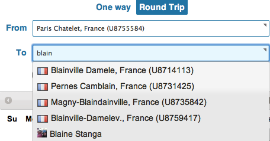



## Unit 3, Lesson 6

### Objective of Lesson 6

In this lesson, we'll document the "behind the scenes view" of TravelPort's E-volve Facebook app.  We'll focus on how it works and how it uses the uAPI to do its work.  

### Starting Up

You can access the Facebook app on the URL `http://apps.facebook.com/travelportapp/`.  Note that this is an "http" not "https" URL.    You'll be presented with a first screen that looks like this, except with your location in the top blank!

 

 

The top blank is populated with a location based on the value in your Facebook profile.  In [Lesson 8](lesson_3-8.html), we'll detail how to do Facebook queries to determine information like this.  The lower blank is for you to put a destination and to indicate the dates of your round-trip travel.  

### Destinations

The lower blank in the screen capture above allows you to type a location in, as you would expect.  However, you'll notice that the system auto-completes both on locations _and_ on your friends names, as in "Blaine" here:

 

 

In the image you'll see some locations in France as well as 'Blaine Stanga', a friend of the author. You can use this app to either travel to locations like Pernes Camblain in France or to the location registered in Blaine's Facebook profile as his "location" or his "hometown".   

In Lessons 8 and 9, we cover how to find these location in more detail, but in general these locations are products of the TravelPort "UCode" database.  You will notice the "U87XXXX" numbers to the right of the locations in France.  This indicates the number of a particular train station in the UCode database.  The E-volve application is querying the UCode data with a search that says, in English, "if any part of the name of the city of a train station or airport has the letters B-L-A-I-N in it, show it to the user."  (If you are familiar with SQL, this is an 'like' query with wildcards.)

### Showing the travel route

Continuing this example, we have chosen "Blaine Stanga" from the pull down menu and chosen a set of days at the end of July to go for a visit.  We are then shown the results of doing a TravelPort shopping request, in particular a Low Fare Search, as we discussed in [Lesson 3](lesson_1-3.html).  This search uses the origin and destination provided in the fields, plus the dates indicated via the calendar section.   After you click the e-Price button you'll see a map like this, indicating the route for the lowest priced result:

 

 

The map above is generated by parsing the `AirSearchRsp` object and examining the `AirPricingResult` collection.  As we explored in [Lesson 2](lesson_1-2.html), it's necessary to reconstruct each `AirSegment` object that is part of the journey and see it's origin and destination airport.  In the map above, the trip from Paris to New Orleans is via Philadelphia and the return is via Charlotte.  You can see the different outbound and return paths with the green lines on the map.

### Showing the travel details

 

 

Below the map, you'll see the details of the journey, as in the screen capture above.  You can see the price of the journey indicated (384 GBP) as well as the icon of US Airways who is the operating carrier of these flights.  Each flight's details such as class of service, dates, duration of flights, flight numbers, planned departure times, etc.  These details are derived in a way similar to our `PrintableItinerary` in [Lesson 3](lesson_1-3.html), although these are certainly prettier!  In summary, the `AirSegment` object's fields are interrogated with methods like `getFlightNumber()` and `getFlightTime()` to get at these details.  It is also possible to differentiate between the issuing carrier and operating carrier through methods on the `AirSegment` which is how the icon for US Airways was chosen in the screen capture.

### Filtering the results

For the convenience of the E-volve application's user we offer some filtering capabilities, although they don't depend on capabilities of the uAPI _per se_. In the above the screen capture you'll see icons of airlines in the upper left corner.  These icons filter the results displayed to include just those that involve that carrier.  

Since the `AirPricingSolution` returned includes a large number of solutions, the E-volve application can create the set of icons as soon as we have received the result from the `AirService` endpoint using the `LowFareSearch` port.  Similarly, the pages (indicated by "1 2 3... 12" in the upper right of the screen capture) are just for the user interface.  We have already received all the results in response to our shopping query and these are stored so the "pages" just permit the user to navigate through these results.

### Rail, Automatically

As we discussed when we covered mixed rail and air searches in Lesson 3, the uAPI is capable of searching for both rail and air travel simultaneously.  

----------------------

[< Return to Unit 2, Lesson 5](lesson_2-3.html) | [Proceed to Unit 3, Lesson 7 >](lesson_3-7.html)

[Table of Contents](index.html)





